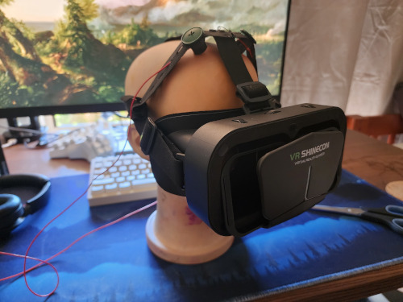
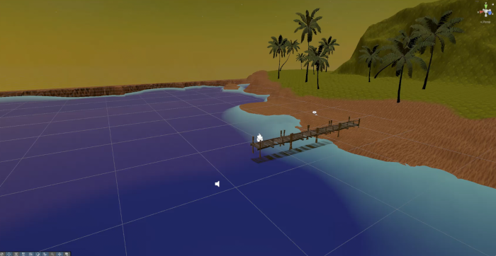
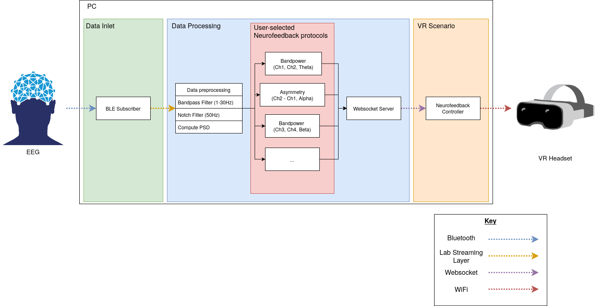

# Brainground

VR/EEG Headset             |  Unity beach scenario
:-------------------------:|:-------------------------:
  |  

Brainground is a closed-loop, multi-protocol neurofeedback training environment for virtual reality. It supports custom, user-configurable neurofeedback training protocols, and displays the feedback through the use of an immersive and relaxing beach scenario. The development of this project was in fullfillment of the requirements outlined by 41030 Engineering Capstone at the University of Technology Sydney.

## Project structure

This project is broken up into several programs, instructions for each can be found in the `README.md` in their individual directory. The following is brief description of what each program does:
1. `unicorn-lsl/`: Grabs data from the g.tec Unicorn Hybrid Black over bluetooth and streams it using the LSL. Is also able to record a stream to a file, and replay the stream as if it was in real-time to make it easier to test other components.
2. `exg-lsl/`: Grabs data from a custom 4 channel EEG device and outputs an LSL stream. Connection to the EEG device is done over Bluetooth Low Energy and controlled through a simple GUI.
3. `processing/`: Pulls in EEG data from an LSL stream, filters and processes it, and then outputs a neurofeedback score to a web socket server. Parameters related to the neurofeedback metrics are configurable through the GUI. The GUI also displays various graphs to visually inspect the live data.
4. `lsl_subscriber/`: Contains random helper scripts to help debug and visualise LSL streams.
4. `analysis/`: Contains all the code used to analyse the data collected for the project.
5. `experiment/`: Contains a helper script used to run the experiment. Can be configured to support arbitrary training blocks, and sends markers for block start & end via an LSL stream.
6. `unity-project/`: Contains a VR unity project that acts as the "feedback" portion of the project.

## Architecture

The above diagram shows the general software architecture of project, and generally how each of the components interact with one another. The following shows how what each section corresponds to within the project structure:
- The data inlet corresponds to either `unicorn-lsl/` or `exg-lsl/`, depending on the EEG headset used.
- The data processing section corresponds to the `processing/` subdirectory.
- The VR scenario corresponds to the `unity-project/` subdirectory.

## Running everything together

1. (If using Phone VR) Install ,  and SteamVR.
2. Start SteamVR, ALVR and PhoneVR and ensure that the default SteamVR scene is visible within the headset. If this doesn't work or the connection is bad, adjust settings within ALVR until it is working.
3. Start Unity and open the unity project (contained within `unity-project`). Ensure that the selected scene is "SampleScene" and the "XRDeviceSimulator" is disabled.
4. Start the software contained in `exg-lsl/`, `processing/` and `experiment/` in seperate shells. This should:
   - Open an interface to connect to the EEG headset using Bluetooth.
   - Open an interface that can configure the neurofeedback protocols.
   - Open a CLI script that should be waiting for enter to be pressed.
5. Turn on the EEG device (if using the `NCBI exg`, this is done by long pressing the button on the side).
6. Connect to it using the interface opened earlier.
7. At this point, you should see data streaming into the interface that controls the neurofeedback protocols. You can customize the protocols now.
8. Put the headset on and press play in the Unity scenario. At this point you should see the VR beach environment within the headset, however the feedbacks will not be adjusting at this point. Wait until the EEG waveform is relatively stable, then press enter on the CLI script that was waiting. This should begin the experiment, and take you through measuring a baseline and the neurofeedback training blocks.
