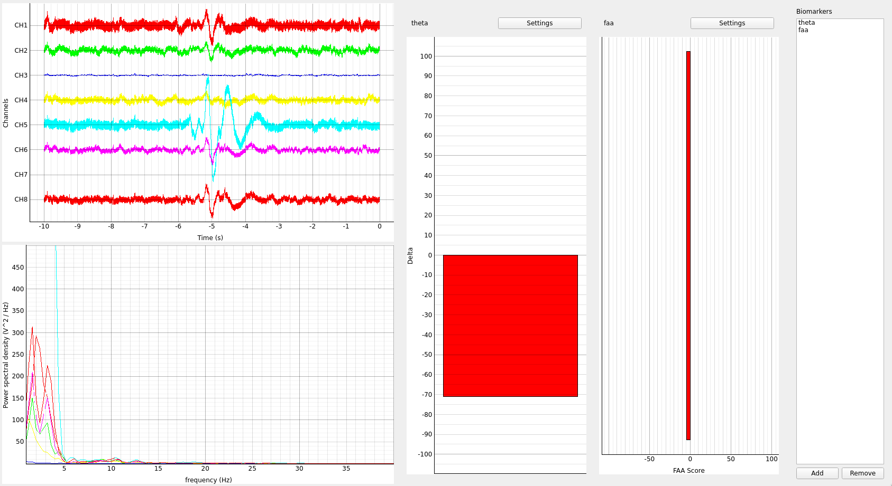

# Processing

The following contains the primary EEG and neurofeedback processing logic for the project. The software reads in a raw EEG signal from the LSL, filters and preprocesses the data, and then computes various neurofeedback scores based on user configured protocols.

## Setup

### Nix (recommended if using Linux)

0. Install the [nix](https://nixos.org/) package manager.
1. Run `nix develop`.

### Windows

1. Install Python 3.12 (or any other compatible version of python)
2. (Optionally) create and activate a python virtual environment `python -m venv .venv && ./.venv/Scripts/activate` (rather than installing packages globally)
3. Install required dependencies: `pip install numpy scipy pylsl pyqtgraph pyside6`

## Running

Run the project using `python main.py`. The GUI will launch once an LSL stream has connected.

Biomarkers can be added by pressing the "Add" button in the bottom right corner. This will show a modal where a biomarker name and type can be configured. The settings for the biomarker can then be configured by pressing the "Settings" button above the biomarkers bar graph display.
